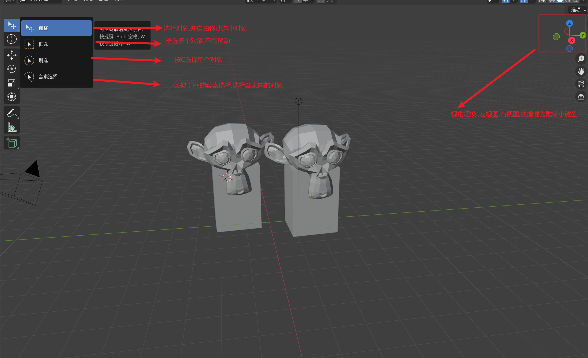

+ three 的三要素 `scene` `camera` `renderer`
+ blernder的三要素 `model` `light` `camera` 

+ Blender 3D建模的基本流程 `BLENDER BASIC WORKFLOW`
  + 建模 MODELING
  + 布光 LIGHTING
  + 材质 TEXTURING
  + 渲染 RENDERING

## 1. blender的快捷键

+ blender的所有快捷键都要在 **英文输入法下才会生效**,即便开启大写锁定,如果是中文输入,有些快捷键依然不会生效

+ 这些快捷键都有对应的图标或者选项菜单可以选,但是可以借助这个快捷键来快速熟悉一些概念

### 1. 移动视角和空间位置的快捷键
+ `鼠标中键  移动鼠标位置`      旋转视角
+ `shift  鼠标中键  移动鼠标` 平移三D空间
+ `滚动鼠标` 缩放视角
+  `shift  A` 新建物体
+ 

### 2. 选中对象后可操纵的快捷键

+ 注意:前置条件是鼠标框选中对象(在下文,我们把一个或者多个称之为 `对象`),再选择的快捷键才有效(否则需要按住 `shift space`才会弹出对象操纵菜单)
  +  `SHIFT` 组合键一般是对个功能键的对象反选
  +  `ALT`组合键一般是对应某个功能键的撤销操作

+ 对象选择工具需要**长按**图标进入小菜单调整
+ 按`C`可以单选对象, 按`A`选择全部对象

+ 选中对象后 按 `G` 移动(Grab 其实是抓取)对象
    + `G  X  鼠标移动` 限制对象只能在X轴方向移动, `Y`和`Z`同理
    + `ALT  G`撤销移动
+ 选中对象后 按 `R` 旋转(rotate)对象
    + `R  X  鼠标移动` 限制对象只能在YZ平面上旋转, `Y`(XZ平面)和`Z`(XY平main)同理
    + `ALT  R`撤销旋转
+ 选中对象后 按 `S` 缩放(scale)对象大小
    + `S  X  鼠标移动` 限制对象只能在X轴方向缩放, `Y`和`Z`同理
    + `ALT  S`撤销缩放
+ 选中对象后 按 `T` 变换(transform)对象大小
+ 隐藏
    + 选中对象后 按 `H` 可以隐藏(hidden)物体
    + 选中对象后 按 `SHIFT H` 可以隐藏(hidden)非选中的物体,简称反选隐藏
    + 选中对象后 按 `ALT H` 可以撤销隐藏
+ 复制
    + 选中对象后 按 `SHIFT D` 可以复制并移动克隆对象

### 3. 视角切换相关的快捷键

+ 数字键盘的快捷键视角变换
    + **1**：前视图（Front View）
    + **3**：右视图（Right View）
    + **7**：顶视图（Top View）
    + **9**：对角视图（Isometric View）
    + 5:  正交视图/透视图切换
    + 2,4,6,8 调整角度 ,默认一次15度
    + 选中对象后,按住小数点 `.`,可以快速将视角切换到这个对象上
+ 按住 `~`键,就会出现上述菜单
+ `ALT 鼠标中键`可以快速切换视角

## 2. Blender 面板

+ 一把来说 Blemder 分为 四大面板,所有面板均 `可替换`, `可拆分`
+ 面板灵活性非常的高类似于 ABOBE 系列的软件, 面板小部件可拆分,可重复,可合并等等,布局可灵活定义
+ 相关快捷键
  + `CTRL SPACE`能够最大化聚焦面板,再按一次恢复

### 1. 游标

+ 游标的两个作用作用

  + 游标在哪里,新建的物体就会出现在哪里

    1. `SHIFT C`游标快速回到坐标原点
    2. `SHIFT S` 调出菜单

    

  + 游标 可以作为对象旋转的轴心点来使用

    

### 2. 模型原点

+ 原点有一点类似于 相对于 模型而言的 一个绝对的点,blender里面操作 物体唯一的时候也只认原点

+ 模型原点如下: 

  

### 3. 偏好设置

+ 编辑 - 偏好设置 - 视图切换 - 缩放至鼠标位置 -开启
  + 这样鼠标点击位置,使用鼠标滚轮,鼠标就会为 这个为视野中心进行缩放
+ 编辑 - 偏好设置 - 视图切换 - 围绕物体旋转 -开启
  + 以选中物体为中心旋转

### 4. 切换坐标轴 

+ `G Z`旋转时,再按一次`Z`可以在全局和局部坐标之间切换

### 5. 更换轴心点

### 6. 开启物体禁止被选中

+ 在collection的筛选中选择箭头

### 7. 开启设想锁定视角

`N`选择视图.选择锁定视角,选择好角度以后,记得取消勾选

### 3. Blender 渲染

+ Blender有两个渲染引擎

+ blender的 4 种渲染方式
+ 